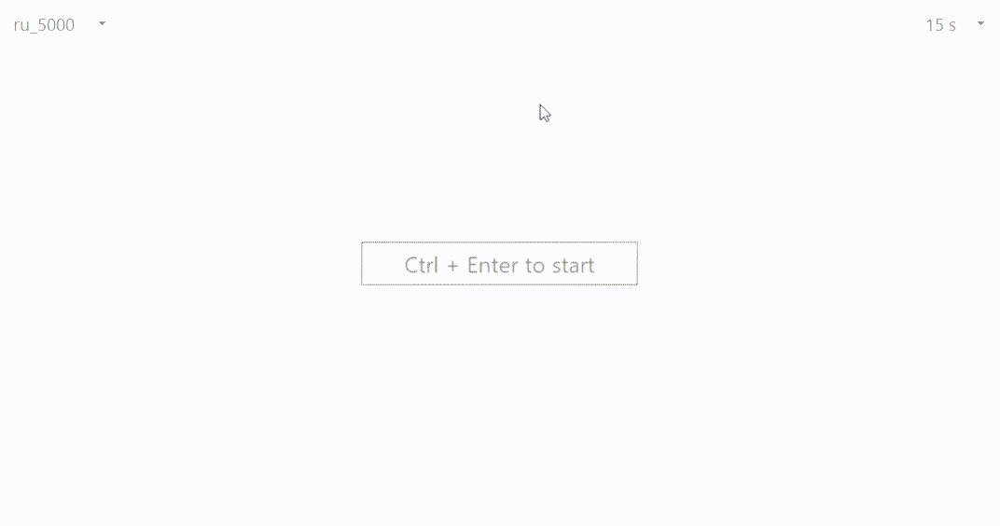

# TyperDesktop

### Project Description
TyperDesktop is a cross-platform desktop application for practicing typing skills. It is written in Qt6, and the CMake build system is used for building the application. This application is a part of TheTyper project. It connects to the TyperWord server to obtain word types and words for typing practice.

### UI
Currently, the application consists of three windows:
1. Start window - where the user can select the type of words to practice. Press "Ctrl + Enter" starts the typing test.

2. Typing window - displays the words to be typed and the typing speed. Press "Esc" quit the typing test.

3. Type result window - displays information about the test result (WMP and accuracy). Press "Esc" quit the type result window or Press "Ctrl + Space" to repeat test.

###  TODO
- Add more customization options for the application's appearance.
- Implement local storage for user's typing statistics.
